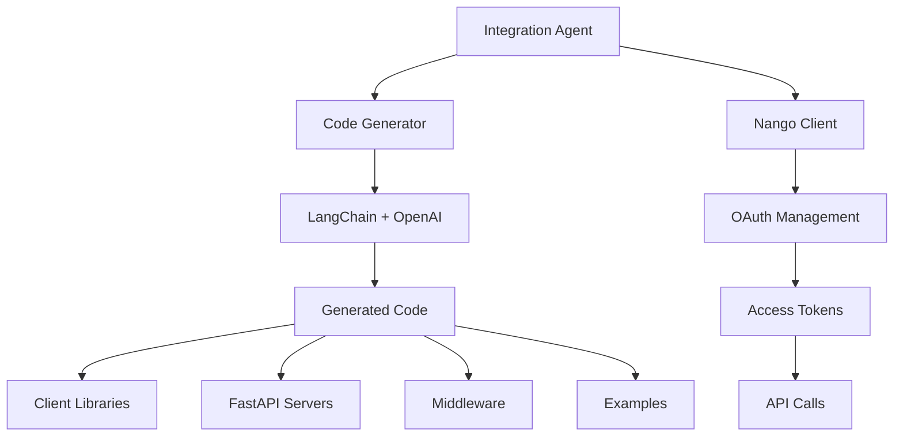

# Integration Automation Agent 🤖

[](https://www.python.org/downloads/)
[](https://fastapi.tiangolo.com/)
[](https://nango.dev)
[](https://langchain.com)

> **Automate API integrations in minutes, not hours!**

The Integration Automation Agent is a powerful tool that automatically generates production-ready API integrations using Nango for OAuth management and LangChain for intelligent code generation. Instead of manually writing integration code for each API, this agent creates everything you need: client libraries, servers, middleware, and usage examples.

## 🌟 Key Features

- **🚀 Automated Code Generation**: Creates complete integration code using AI
- **🔐 Seamless OAuth**: Leverages Nango for hassle-free authentication
- **⚡ 10 Pre-configured APIs**: Ready-to-use integrations for popular services
- **🏗️ Production Ready**: Includes error handling, rate limiting, and monitoring
- **📝 Complete Documentation**: Auto-generated examples and API docs
- **🛠️ Developer Friendly**: FastAPI servers with async/await patterns

## 🎯 Supported Integrations

| Service | Provider | Features |
|---------|----------|-----------|
| **Slack** | `slack` | Messages, Channels, Users |
| **GitHub** | `github` | Repos, Issues, Users |
| **Google Drive** | `google-drive` | Files, Upload, Download |
| **Notion** | `notion` | Databases, Pages, Queries |
| **HubSpot** | `hubspot` | Contacts, Deals, CRM |
| **Salesforce** | `salesforce` | Accounts, Leads, Opportunities |
| **Discord** | `discord` | Messages, Guilds, Users |
| **Shopify** | `shopify` | Products, Orders, Store |
| **Trello** | `trello` | Boards, Cards, Lists |
| **Airtable** | `airtable` | Records, Tables, Bases |

## 🚀 Quick Start

### 1. Installation

```bash
# Clone the repository
git clone <your-repo-url>
cd integration-automation-agent

# Run automated setup
python setup.py --dev
```

### 2. Configuration

Edit the `.env` file with your credentials:

```bash
# Nango Configuration
NANGO_SECRET_KEY=your_nango_secret_key
NANGO_PUBLIC_KEY=your_nango_public_key

# OpenAI Configuration (for code generation)
OPENAI_API_KEY=your_openai_api_key
```

### 3. Generate Integrations

```bash
# Start the agent
python main.py

# OR use the startup script
./start.sh  # Unix/Linux/macOS
start.bat   # Windows
```

### 4. Follow the Interactive Setup

The agent will guide you through:
1. **Selecting APIs** - Choose from 10 pre-configured integrations
2. **Entering Credentials** - Provide OAuth client ID and secret for each
3. **Code Generation** - AI generates all necessary code
4. **Nango Integration** - Automatically sets up OAuth flows

## 📁 Generated Structure

After running the agent, you'll get:

```
generated_integrations/
├── slack/
│   ├── client.py          # API client with async methods
│   ├── server.py          # FastAPI server
│   ├── middleware.py      # Rate limiting, caching, etc.
│   ├── examples.py        # Usage examples
│   └── config.json        # Integration configuration
├── github/
│   └── ... (same structure)
└── integration_summary.md # Overview of all integrations
```

## 💻 Usage Examples

### Basic Client Usage

```python
import asyncio
from generated_integrations.slack.client import SlackClient

async def send_message():
    async with SlackClient(
        connection_id="user_123",
        nango_public_key="your_public_key",
        provider_config_key="slack"
    ) as client:
        
        response = await client.send_message(
            channel="#general",
            text="Hello from Integration Agent! 🤖"
        )
        
        if response.success:
            print(f"Message sent: {response.data}")
        else:
            print(f"Error: {response.error_message}")

# Run the example
asyncio.run(send_message())
```

### FastAPI Server

Each integration includes a ready-to-run FastAPI server:

```python
# Start the Slack integration server
python generated_integrations/slack/server.py

# Access API documentation
# http://localhost:8000/docs
```

### Advanced Usage with Middleware

```python
from generated_integrations.slack.middleware import IntegrationMiddleware

# Middleware handles caching, rate limiting, and transformations
middleware = IntegrationMiddleware("slack", cache_ttl=300)

# All requests automatically benefit from:
# - Response caching
# - Rate limit management
# - Error handling and retries
# - Request/response transformation
```

## 🏗️ Architecture



### Core Components

- **Integration Agent** (`main.py`): Orchestrates the entire process
- **Code Generator**: Uses LangChain to generate production-ready code
- **Nango Client**: Manages OAuth flows and token refresh
- **Base Client** (`base_client.py`): Common functionality for all integrations
- **Base Server** (`base_server.py`): FastAPI template with OAuth support
- **Middleware** (`middleware.py`): Rate limiting, caching, error handling

## 🔧 Configuration

### Environment Variables

| Variable | Description | Required |
|----------|-------------|----------|
| `NANGO_SECRET_KEY` | Your Nango secret key | Yes |
| `NANGO_PUBLIC_KEY` | Your Nango public key | Yes |
| `OPENAI_API_KEY` | OpenAI API key for code generation | Yes |
| `APP_ENV` | Environment (development/production) | No |
| `LOG_LEVEL` | Logging level (INFO/DEBUG/ERROR) | No |

### Custom Configuration

Edit `config.json` to customize:

```json
{
  "default_settings": {
    "cache_ttl": 300,
    "rate_limit_per_minute": 60,
    "max_retries": 3,
    "timeout_seconds": 30
  },
  "logging": {
    "level": "INFO",
    "format": "json",
    "file": "logs/integration_agent.log"
  }
}
```

## 🔐 OAuth Flow

The agent handles the complete OAuth flow:

1. **Setup Integration** in Nango with your credentials
2. **Generate OAuth URL** for user authorization
3. **Handle Callback** and store tokens securely
4. **Auto-refresh Tokens** when they expire
5. **Make Authenticated Requests** seamlessly

```python
# OAuth flow is handled automatically
# Just provide connection_id and the client handles the rest
client = SlackClient(
    connection_id="user_123",  # Unique identifier for this user
    nango_public_key="pk_...",
    provider_config_key="slack"
)
```

## 📊 Monitoring & Analytics

### Built-in Metrics

Every integration includes comprehensive monitoring:

```python
# Get client statistics
stats = client.get_stats()
print(f"Total requests: {stats['total_requests']}")
print(f"Error rate: {stats['error_rate']:.2%}")

# Get middleware metrics
middleware_stats = middleware.get_metrics()
print(f"Cache hit rate: {middleware_stats['cache_hit_rate']:.2%}")
```

### Health Checks

```bash
# Check integration health
curl http://localhost:8000/health

# Get detailed stats
curl http://localhost:8000/stats?connection_id=user_123
```

## 🧪 Testing

### Run Integration Tests

```bash
# Run all tests
python -m pytest

# Test specific integration
python -m pytest tests/test_slack_integration.py

# Run with coverage
python -m pytest --cov=generated_integrations
```

### Manual Testing

```bash
# Test generated examples
python generated_integrations/slack/examples.py

# Test specific functionality
python -c "
import asyncio
from generated_integrations.slack.client import SlackClient
# ... test code here
"
```

## 🔧 Development

### Development Setup

```bash
# Install with development tools
python setup.py --dev

# Format code
python -m black .

# Lint code
python -m flake8 .

# Type checking
python -m mypy .
```

### Adding New Integrations

To add support for a new API:

1. **Add API Configuration** to `SUPPORTED_INTEGRATIONS` in `main.py`:

```python
"new_api": {
    "provider": "new-api",
    "base_url": "https://api.newservice.com",
    "auth_url": "https://newservice.com/oauth/authorize",
    "token_url": "https://newservice.com/oauth/token",
    "scopes": ["read", "write"],
    "endpoints": [
        {"name": "get_data", "method": "GET", "path": "/data"},
        {"name": "create_item", "method": "POST", "path": "/items"}
    ]
}
```

2. **Test the Integration**:

```bash
python main.py
# Select your new integration and test
```

## 🚀 Deployment

### Production Deployment

1. **Environment Setup**:
```bash
export APP_ENV=production
export LOG_LEVEL=INFO
# Set all required environment variables
```

2. **Use Docker** (optional):
```dockerfile
FROM python:3.9
COPY . /app
WORKDIR /app
RUN python setup.py
CMD ["python", "main.py"]
```

3. **Deploy with Process Manager**:
```bash
# Using PM2
pm2 start main.py --name integration-agent

# Using systemd
sudo systemctl start integration-agent
```

### Scaling Considerations

- Use **Redis** for distributed caching and rate limiting
- Deploy **multiple instances** behind a load balancer
- Implement **database storage** for persistent configuration
- Set up **monitoring** with Prometheus/Grafana

## 🤝 Contributing

We welcome contributions! Here's how to get started:

1. **Fork the repository**
2. **Create a feature branch**: `git checkout -b feature/new-integration`
3. **Make your changes** and add tests
4. **Run the test suite**: `python -m pytest`
5. **Submit a pull request**

### Contribution Guidelines

- Follow the existing code style (Black formatting)
- Add tests for new functionality
- Update documentation as needed
- Ensure all checks pass

## 📄 License

This project is licensed under the MIT License - see the [LICENSE](LICENSE) file for details.

## 🆘 Support

### Getting Help

- **Documentation**: Check the `generated_integrations/` directory for examples
- **Issues**: Open an issue on GitHub for bugs or feature requests
- **Discussions**: Use GitHub Discussions for questions and ideas

### Common Issues

**Q: "Failed to create integration in Nango"**
A: Check your Nango credentials and ensure the provider is supported in your Nango account.

**Q: "OpenAI API rate limit exceeded"**
A: The agent makes several API calls for code generation. Consider upgrading your OpenAI plan or running with fewer integrations at once.

**Q: "Import errors in generated code"**
A: Run `pip install -r requirements.txt` to ensure all dependencies are installed.

### FAQ

**Q: Can I use this without Nango?**
A: The current version is designed specifically for Nango's OAuth management. Supporting other OAuth providers would require significant modifications.

**Q: How much does this cost to run?**
A: Costs include:
- OpenAI API usage for code generation (~$0.01-0.10 per integration)
- Nango subscription (free tier available)
- Your chosen hosting platform

**Q: Is the generated code production-ready?**
A: Yes! The generated code includes error handling, rate limiting, logging, and follows production best practices. However, always review and test before deploying.

## 🎉 Acknowledgments

- **Nango** for excellent OAuth management
- **LangChain** for AI-powered code generation
- **FastAPI** for the fantastic web framework
- **OpenAI** for GPT models
- The open-source community for inspiration and tools

---

**Ready to automate your integrations?** 🚀

```bash
git clone <your-repo-url>
cd integration-automation-agent
python setup.py --dev
./start.sh
```

Let the agent handle the boring integration work while you focus on building amazing features! ✨